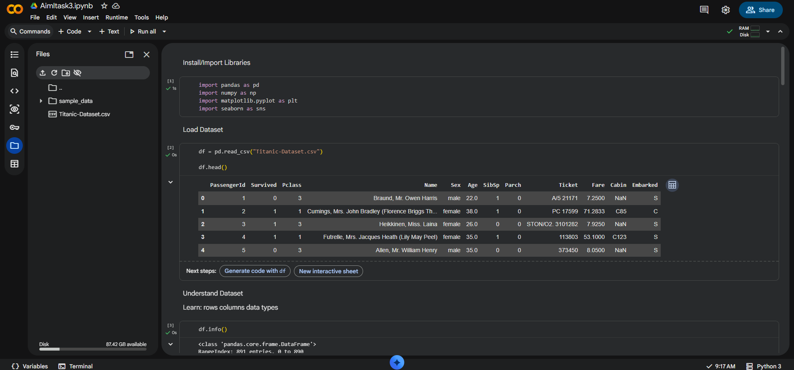
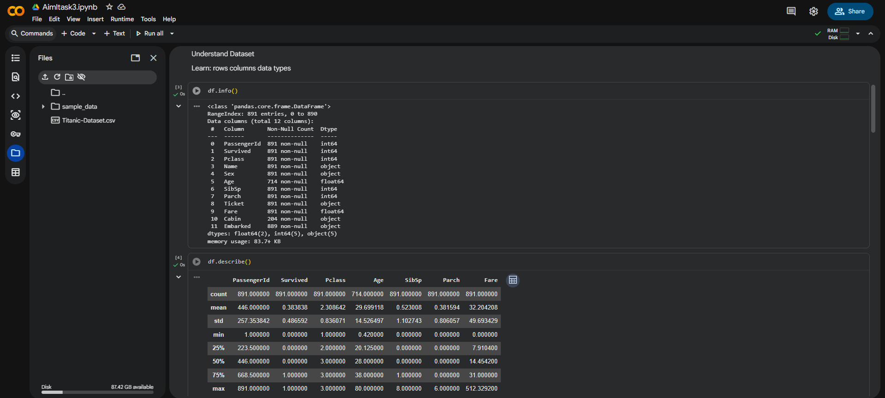
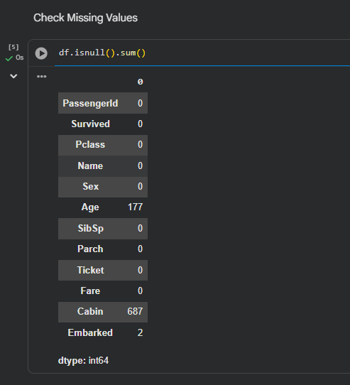
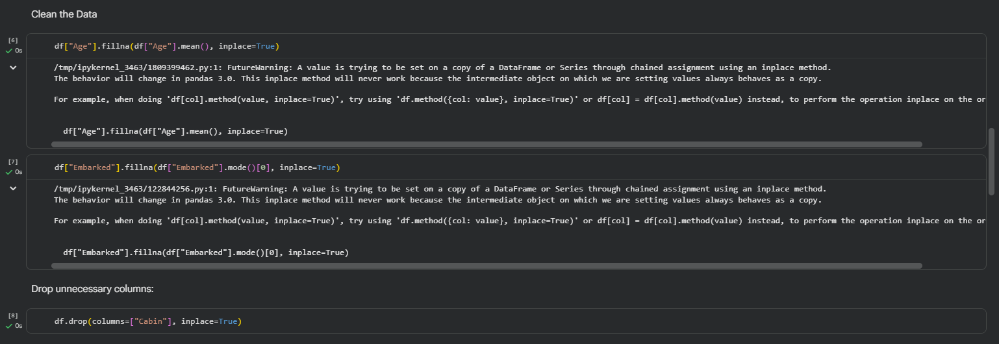
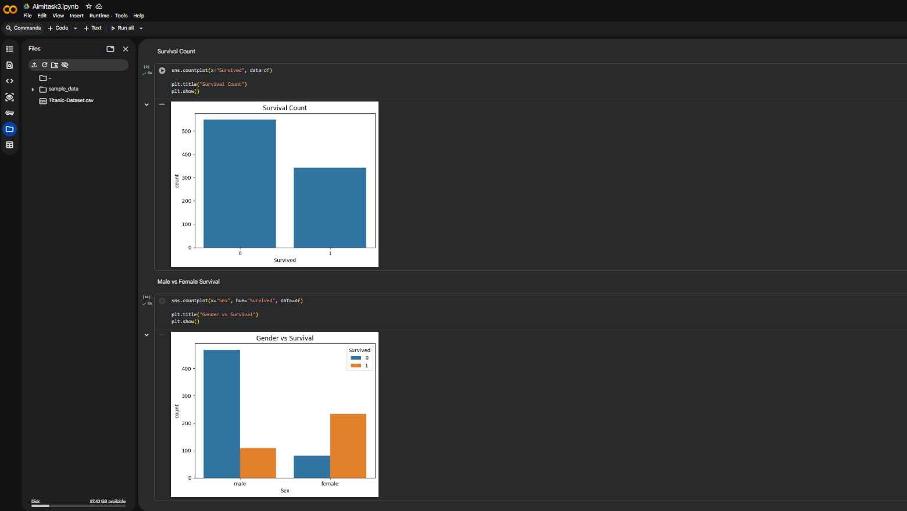
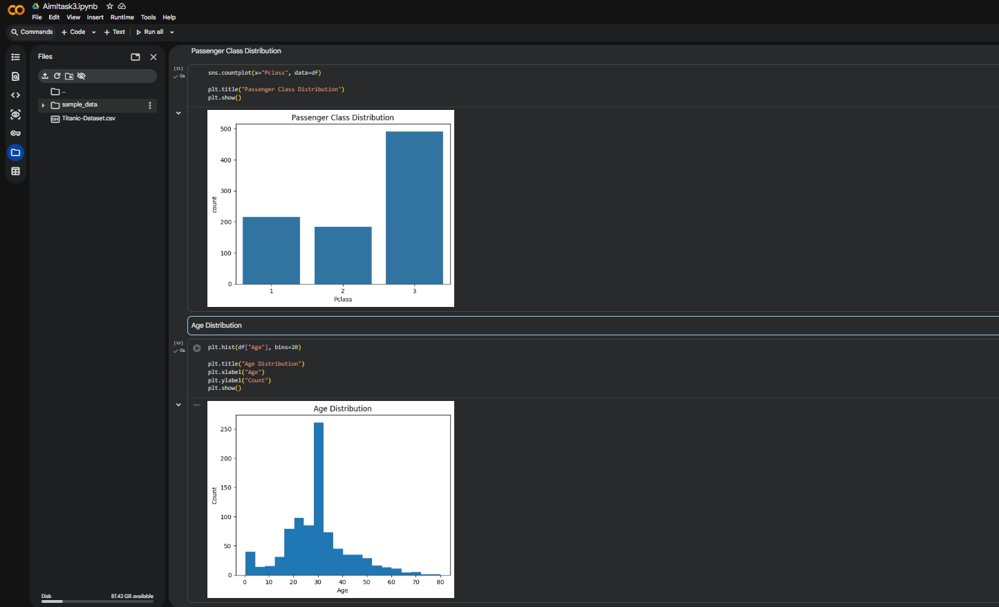

# Data Collection, Cleaning & Exploratory Data Analysis (EDA)

## Objective
This project focuses on understanding how real-world datasets are prepared before training machine learning models. The Titanic dataset is used for data cleaning and exploratory data analysis.

## Dataset Used
Titanic Dataset

## Tasks Performed
- Data collection
- Understanding dataset structure
- Handling missing values
- Data cleaning
- Exploratory Data Analysis (EDA)
- Data visualization using graphs

## Libraries Used
- Pandas
- NumPy
- Matplotlib
- Seaborn

## Key Insights
- Female passengers had a higher survival rate.
- Most passengers belonged to 3rd class.
- Missing values were identified and cleaned.
- Data visualizations helped understand relationships and trends.

## Screenshots

### Dataset Loading

### Dataset Understanding

### Missing Values Check

### Data Cleaning

### Exploratory Data Analysis

## Outcome
This project improved understanding of data preprocessing, data cleaning, and exploratory data analysis techniques used in AI/ML workflows.
